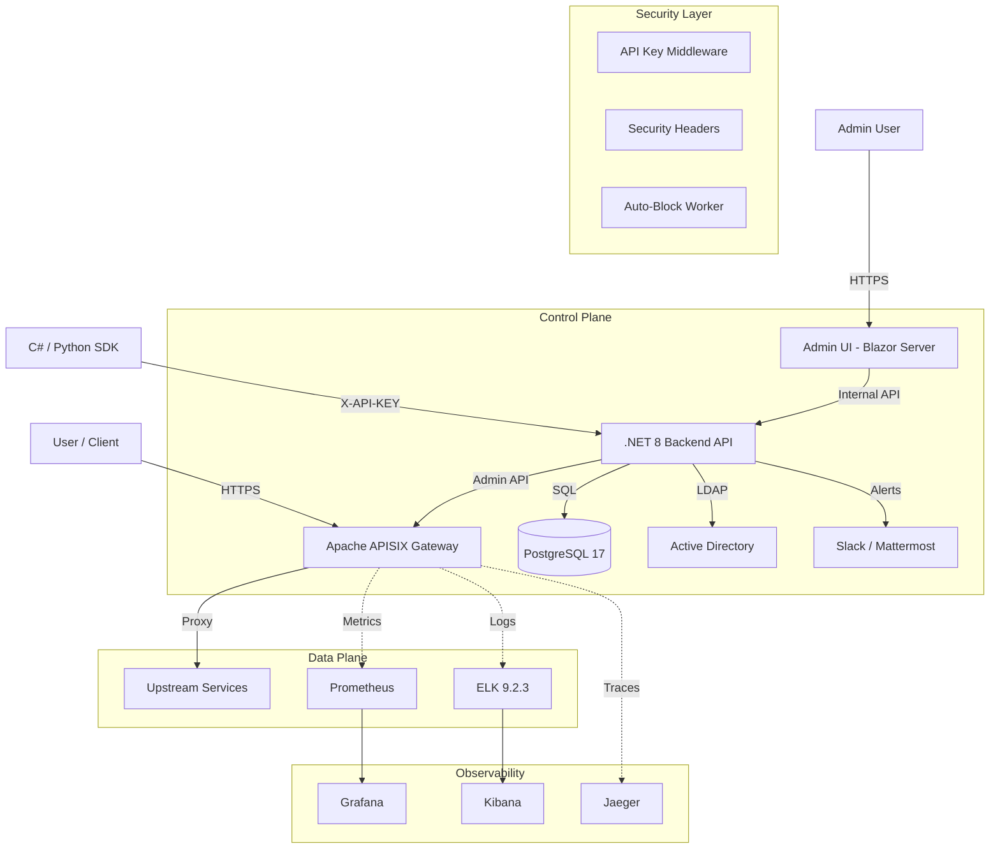

# System Architecture

## Overview
Milk API Manager System is an enterprise-grade API management solution built on .NET 8, acting as the control plane for Apache APISIX. It features API Key authentication, audit logging, auto-defense, and deep integration with enterprise identity (LDAP).

## Architecture Diagram

## Core Components

### 1. Backend API (.NET 8)
-   **Role**: Central control plane.
-   **Database**: PostgreSQL 17 (Entity Framework Core, Code-First Migrations).
-   **Auth**: API Key middleware (`X-API-KEY` header) for all `/api/*` endpoints.
-   **Health**: `/health` endpoint via ASP.NET Health Checks.
-   **Features**:
    -   **Route Management**: Syncs routes to APISIX.
    -   **Security**: Per-Route Whitelists, Global Blacklists, Auto-Blocking.
    -   **PII Masking**: Dynamic regex-based masking via custom APISIX plugin.
    -   **Audit**: Logs all configuration changes.
    -   **SDK**: Auto-generated C# and Python clients.

### 2. Apache APISIX
-   **Role**: High-performance API Gateway.
-   **Plugins Used**:
    -   `ip-restriction`: Managed via Backend (Whitelist).
    -   `traffic-blocker`: Managed via Backend (Blacklist).
    -   `pii-masker`: Custom Lua plugin for masking sensitive data.
    -   `prometheus`: Exposes metrics (including `pii_masked_total`).

### 3. Security Architecture
-   **API Key Auth**: All management API calls require `X-API-KEY` header.
-   **Security Headers**: `X-Content-Type-Options`, `X-Frame-Options`, `X-XSS-Protection`, `Content-Security-Policy`, `Referrer-Policy`.
-   **Auto-Block Worker**: Monitors Prometheus for auth error spikes and auto-bans IPs.
-   **Secrets**: Externalized via `.env` (not committed to Git).

### 4. Database Schema (PostgreSQL)
-   **AuditLogEntries**: `Id`, `Action`, `User`, `Resource`, `Details`, `Timestamp`.
-   **BlacklistEntries**: `Id`, `IpCidr`, `Reason`, `ExpiresAt`, `AddedBy`.
-   **WhitelistEntries**: `Id`, `RouteId`, `IpCidr`, `Reason`, `ExpiresAt`, `AddedBy`.
-   **PiiMaskingRules**: `Id`, `RouteId`, `FieldPath`, `Pattern`, `MaskWith`.
-   **AccessRequests**: `Id`, `ProjectName`, `RequestedTier`, `Status`, `AdminComment`.

## Infrastructure Services

| Service | Image | Port | Purpose |
|---|---|---|---|
| APISIX | `apache/apisix:3.11.0` | 9080 | API Gateway |
| etcd | `coreos/etcd:v3.5.15` | 2379 | Config store |
| PostgreSQL | `postgres:17-alpine` | 5432 | Application DB |
| Prometheus | `prom/prometheus:v3.2.1` | 9090 | Metrics |
| Grafana | `grafana/grafana:11.5.2` | 3000 | Dashboards |
| Elasticsearch | `elasticsearch:9.2.3` | 9200 | Log storage |
| Logstash | `logstash:9.2.3` | 5044 | Log pipeline |
| Kibana | `kibana:9.2.3` | 5601 | Log UI |
| Jaeger | `jaeger:1.62` | 16686 | Tracing |
