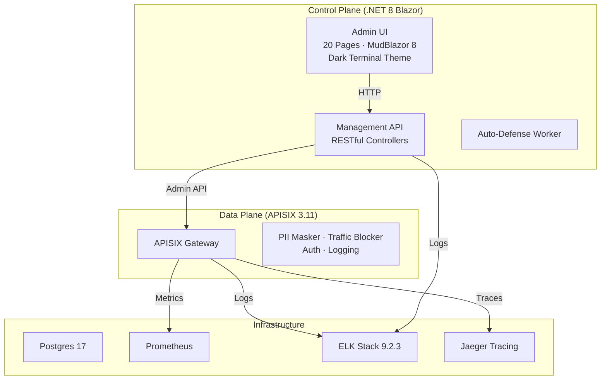

# 🥛 Milk API Manager System
> **企業級全生命週期 API 管理與安全治理平台**

[](https://github.com/tedtv1007-ctrl/milk-api-manager-system/actions)


Milk API Manager 是一套基於 **Apache APISIX** 打造的現代化 API 管理平台，專為企業內部（Intranet）設計，提供從設計、測試、防禦到分析的一站式解決方案。內建 **Blazor Server** 全功能控制面板，可完全取代 APISIX Dashboard，搭配暗色 Trading Terminal 風格 UI 提供專業級操作體驗。

---

## ✨ 核心亮點 (Core Features)

### ⚡ 全功能 Blazor Gateway 控制面板 (Gateway Control Plane)
以 Blazor Server + MudBlazor 8 打造的統一管理介面，**完整取代 apisix-dashboard**，涵蓋所有 APISIX Admin API 操作：
*   **Routes 管理**：CRUD 路由、HTTP 方法過濾、inline upstream 與 plugin JSON 配置。
*   **Services / Upstreams 管理**：負載均衡策略 (roundrobin/chash/ewma/least_conn)、節點權重。
*   **SSL 憑證管理**：PEM 上傳、SNI 配置、憑證生命週期管理。
*   **Global Plugin Rules**：全域插件規則，一鍵套用至所有路由。
*   **即時 Dashboard**：六大指標卡片 + Server Info + 快速導航。
*   **Dark Trading Terminal UI**：參考量化交易看板設計，全暗色主題、彩色邊框指示器、Monospace 數值顯示。

### 🛡️ 主動式安全治理 (Security & Privacy)
*   **動態 PII 脫敏**：透過自研 Lua 插件，利用 Regex 即時遮蔽 Response 中的 Email、手機、個資等敏感資訊。
*   **AI 自動化防禦**：聯動 Prometheus 監控，自動識別並封鎖高頻攻擊與惡意掃描 IP (Auto-Blocking)。
*   **通知中心**：整合多頻道 Webhook (Slack/Mattermost)，重大安全事件即時推播。

### 🛠️ 開發者自助門戶 (Developer Experience)
*   **自服務申請**：內部團隊可自主申請 API 訪問權限，管理員一鍵審核，系統自動撥備 APISIX Consumer。
*   **API 測試沙盒**：文件中心嵌入「Live Test」功能，一鍵驗證 API 健康度與延遲。
*   **Mock Lab**：無需後端代碼，直接在網關定義模擬回應，加速前端開發。

### 📊 深度可觀測性 (Observability)
*   **智慧監控看板**：即時 P95 延遲趨勢圖與 Top 5 性能瓶頸分析。
*   **ELK 9.2.3 全量分析**：結構化收集網關訪問日誌與後端審計日誌，具備長效分析與合規報表能力。
*   **壓測集成**：內建 k6 引擎，支援在介面直接發起壓力測試。

---

## 🎨 UI 設計風格 (Dark Trading Terminal Theme)

全站採用暗色 Trading Terminal 設計語言，靈感取自量化交易系統看板：

| 元素 | 設計 |
|------|------|
| **背景** | Deep Navy (#0d1117) + Surface (#161b22) |
| **側邊欄** | 分類區段 (GATEWAY / API / DEVELOPER / OPERATIONS)，彩色圖標 |
| **頂部列** | 即時時間戳 + .NET 8 技術徽章 + GitHub 連結 |
| **指標卡片** | 彩色左邊框 (Blue/Green/Purple/Cyan/Yellow)、Monospace 大字體數值 |
| **表格** | 深色表頭、hover 高亮、zero-elevation 無陰影 |
| **Dialog** | 深色背景 + 細邊框，一致的 Outlined 輸入框 |
| **字型** | Inter (UI) + JetBrains Mono (數據/代碼) |

---

## 🏗️ 系統架構 (Architecture)



### Blazor Admin UI 頁面清單 (20 Pages)

| 區段 | 頁面 | 路由 | 說明 |
|------|------|------|------|
| **Gateway** | Dashboard | `/gateway` | 六指標概覽 + Server Info |
| | Routes | `/routes-management` | 路由 CRUD + Plugin JSON |
| | Services | `/services-management` | 服務定義 + Upstream |
| | Upstreams | `/upstreams-management` | 負載均衡 + 節點管理 |
| | SSL Certs | `/ssl-management` | TLS 憑證上傳 + SNI |
| | Global Plugins | `/global-plugins` | 全域插件規則 |
| **API Mgmt** | API Inventory | `/apis` | 服務清單 + 風險分級 |
| | IP Blacklist | `/blacklist` | IP 封鎖管理 |
| | Consumers | `/consumers` | 消費者 + 配額管理 |
| | Traffic Tiers | `/consumer-groups` | 流量分級 + 限速 |
| **Developer** | Self-Service Portal | `/dev-portal` | 開發者自助門戶 |
| | Mock Lab | `/mock-lab` | 模擬回應定義 |
| **Operations** | Traffic Intelligence | `/consumer-analytics` | 流量分析 + SLA |
| | PII Protection | `/pii-management` | 動態脫敏規則 |
| | Stress Test | `/load-testing` | 壓力測試控制台 |
| | Audit Logs | `/audit-logs` | 稽核日誌 + CSV |
| | API Governance | `/api-inventory` | 合規盤點 + 風險分級 |
| | Alert Rules | `/alert-rules` | 告警規則配置 |
| | Reports | `/reports` | 統計報表 + CSV |
| | System Sync | `/sync-status` | 系統同步狀態 |

---

## 🚀 快速啟動 (Quick Start)

### 1. 啟動基礎設施 (Docker)
```bash
docker-compose up -d
```

### 2. 執行全系統自動驗證
本專案內建「全綠」驗證腳本，確保所有組件（.NET, Python, Playwright, Docker）運行正常。
*   **Windows**: `./scripts/verify-all.ps1`
*   **Linux/Zeabur**: `./scripts/verify-all.sh`

### 3. 存取入口
| 服務 | URL | 說明 |
|------|-----|------|
| **Blazor 控制面板** | `http://localhost:5000` | 全功能管理 UI (Dark Theme) |
| **API 網關** | `http://localhost:9080` | APISIX 流量入口 |
| **Swagger API 文件** | `http://localhost:5001/swagger` | RESTful API Spec |
| **APISIX Dashboard** | `http://localhost:9000` | 原生 Dashboard (備用) |
| **Grafana** | `http://localhost:3000` | 指標看板 |
| **Kibana** | `http://localhost:5601` | 日誌分析 |
| **Jaeger** | `http://localhost:16686` | 分散式追蹤 |

---

## 🔑 Demo 預設帳密 (Default Credentials)

> [!NOTE]
> 系統內建預設值，**不需要任何 `.env` 即可直接啟動 Demo**。正式上線時請建立 `.env` 覆蓋預設值（參考 `.env.example`）。

| 服務 | URL | 預設帳密 |
|---|---|---|
| 管理後台 (Blazor) | `http://localhost:5000` | 無需登入 |
| Swagger API 文件 | `http://localhost:5001/swagger` | 無需登入 |
| API 端點 (API Key) | `http://localhost:5001/api/*` | Header `X-API-KEY: milk-admin-secret-key-change-me` |
| API 端點 (JWT) | `http://localhost:5001/api/*` | 先用下方帳號登入取得 Token |
| Grafana | `http://localhost:3000` | `admin` / `admin` |
| Kibana | `http://localhost:5601` | 無需登入 |
| APISIX Dashboard | `http://localhost:9000` | 見 `dashboard_conf/conf.yaml` |
| PostgreSQL | `localhost:5432` | `milk_user` / `milk_password` |
| Health Check | `http://localhost:5001/health` | 無需登入 |

### SSO Demo 帳號 (USE_TEST_MODE=true)

| 帳號 | 密碼 | 角色 | 權限說明 |
|---|---|---|---|
| `admin` | `admin` | Admin, Operator, Viewer | 完整管理權限 |
| `operator` | `operator` | Operator, Viewer | 操作黑白名單、PII 規則 |
| `viewer` | `viewer` | Viewer | 唯讀 |

```bash
# 登入取得 JWT Token
curl -X POST http://localhost:5001/api/auth/login \
  -H "Content-Type: application/json" \
  -d '{"username":"admin","password":"admin"}'

# 使用 JWT Token 呼叫 API
curl http://localhost:5001/api/blacklist \
  -H "Authorization: Bearer <token>"
```

---

## 🧪 測試 (Testing)

### Unit Tests
共 **14 個測試檔案**，涵蓋所有 Controller 端點（含 Gateway CRUD）：

```
Controllers/
├── AnalyticsControllerTests.cs
├── AuthControllerTests.cs
├── BlacklistControllerTests.cs
├── ConsumerControllerTests.cs
├── GlobalRuleControllerTests.cs
├── KeysControllerTests.cs
├── RouteControllerTests.cs
├── ServerInfoControllerTests.cs
├── ServiceControllerTests.cs
├── SloMetricsControllerTests.cs
├── SSLControllerTests.cs
├── SyncStatusControllerTests.cs
├── UpstreamControllerTests.cs
└── WhitelistControllerTests.cs
```

```bash
cd backend
dotnet test MilkApiManager.Tests/MilkApiManager.Tests.csproj
```

### E2E Tests (Playwright)
共 **7 個端對端測試檔案**，涵蓋 API 驗證、UI 頁面、Gateway CRUD：

```
e2e/tests/
├── api-endpoints.spec.js      # API 端點驗證
├── auth-sso.spec.js           # SSO 登入流程
├── crud-operations.spec.js    # CRUD 操作
├── gateway-crud.spec.js       # Gateway Routes/Services/Upstreams/SSL/GlobalPlugins CRUD
├── gateway-ui-pages.spec.js   # Gateway UI 頁面導航驗證
├── pii-masking.spec.js        # PII 脫敏功能
└── ui-pages.spec.js           # 全站 UI 頁面測試
```

```bash
cd e2e
npm install
npx playwright test
```

---

## 📖 使用與操作
詳細的操作流程與功能說明，請參考：
👉 **[Milk API Manager 操作手冊](docs/manual/USER_GUIDE.md)**

---

## 🛠️ 技術棧 (Tech Stack)

| Layer | Technology |
|-------|-----------|
| **Frontend** | Blazor Server · MudBlazor 8.15 · Dark Trading Terminal CSS |
| **Backend** | .NET 8 · ASP.NET Core · Entity Framework Core |
| **Gateway** | Apache APISIX 3.11 · Custom Lua Plugins |
| **Database** | PostgreSQL 17 |
| **Observability** | Prometheus · Grafana · Jaeger · ELK 9.2.3 |
| **Testing** | xUnit · Moq · Playwright |
| **Infra** | Docker Compose · GitHub Actions CI |

---

## 📅 開發藍圖 (Roadmap)
- [x] **Phase 1**: 基礎設施與容器化 (Docker + APISIX)。
- [x] **Phase 2**: 後端管理 API 與路由自動同步。
- [x] **Phase 3**: 動態 PII 防護與 AI 自動防禦。
- [x] **Phase 4**: 開發者自助門戶與 Mock Server。
- [x] **Phase 5**: ELK 9.2.3 深度日誌分析。
- [x] **Phase 6**: API SDK 自動生成器 (C# / Python)。
- [x] **Phase 7**: Blazor Gateway 控制面板（完整取代 apisix-dashboard）。
- [x] **Phase 8**: Dark Trading Terminal UI 主題統一。
- [x] **Phase 9**: Gateway CRUD 單元測試 + E2E 測試覆蓋。
- [ ] **Phase 10**: 企業 SSO (LDAP/AD) 深度權限對齊。

---

## 🤝 協作規範
本專案採用 **「分散式多節點開發模式」**：
1.  **心跳同步**：啟動前必先讀取 `HEARTBEAT.md`。
2.  **人機鎖定**：開發時請在 `HEARTBEAT.md` 設置 `USER_ACTIVE` 或 `VPS_ID`。
3.  **雲端驗證**：所有 Push 必須通過 GitHub Actions 的整合測試。

---
*Created with ❤️ by OpenClaw for Enterprise API Excellence.*
