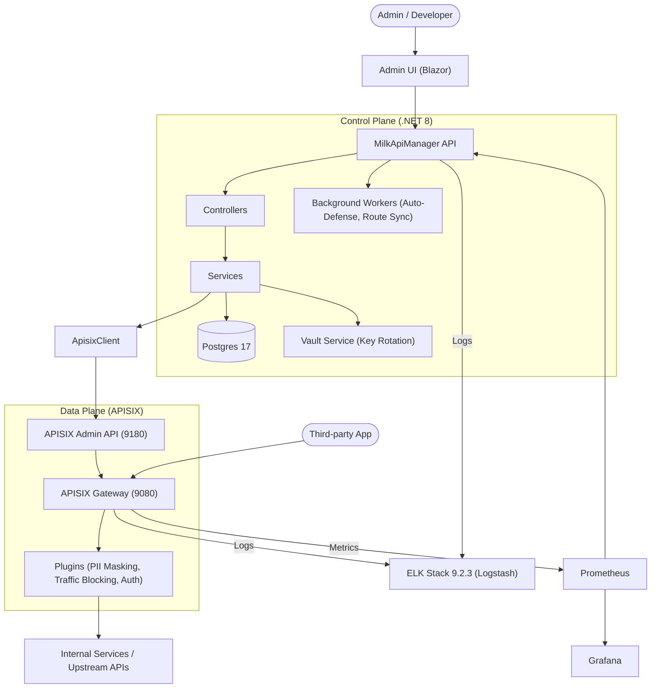

# Architecture Flow (System Overview)

This document describes the interaction flow between the various components of the Milk API Manager System.

### Key Interaction Flows:
1.  **PII Protection**: Defined in UI -> Persisted in Postgres -> Synced via ApisixClient -> Executed in Lua Plugin.
2.  **Auto-Defense**: Prometheus metrics queried by Worker -> Malicious IP detected -> Pushed to Blacklist via Admin API.
3.  **Self-Service**: Request submitted in Dev Portal -> Approved by Admin -> Consumer & API Key auto-provisioned in APISIX.
