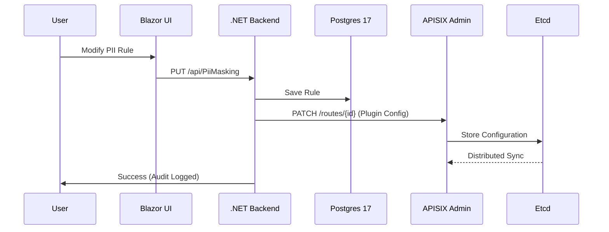

# Architecture Flow (Detailed Technical View)

This document provides a low-level view of how data and control commands flow through the Milk API Manager.

## 1. Control Plane Flow (API Management)
When an administrator or developer performs an action in the UI:
1.  **Request**: Blazor UI calls `.NET Web API`.
2.  **Auth/Audit**: API validates permissions and records an entry via `AuditLogService` (sent to both Postgres and ELK).
3.  **Persistence**: Configuration (e.g., PII rules, SLA targets) is stored in **Postgres 17**.
4.  **Gateway Sync**: `ApisixClient` sends a REST request to **APISIX Admin API (Port 9180)** using the `X-API-KEY`.
5.  **Hot Reload**: APISIX updates its internal state (etcd) without a restart.

## 2. Data Plane Flow (Traffic Handling)
When an external application calls an API:
1.  **Ingress**: Traffic hits **APISIX Gateway (Port 9080)**.
2.  **Plugin Execution**: 
    *   `key-auth`: Validates the consumer's API Key.
    *   `limit-count`: Enforces the Tier-based rate limit (Gold/Silver/Free).
    *   `pii-masker`: (Response phase) Applies Regex to sensitive fields in the JSON body.
3.  **Upstream**: Gateway forwards the request to the internal service.
4.  **Egress**: The sanitized response is sent back to the application.

## 3. Observability Loop
1.  **Metric Scraping**: **Prometheus** pulls metrics from the `/apisix/prometheus/metrics` endpoint.
2.  **Log Shipping**: **APISIX http-logger** sends real-time access logs to **Logstash (Port 8081)**.
3.  **Active Defense**: 
    *   `AutoBlockWorker` queries Prometheus every 30s.
    *   If a threat is detected, it triggers the Control Plane flow to block the IP.
4.  **Visualization**: **Grafana** and **Kibana** visualize the aggregated data.

