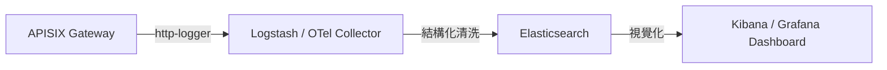

# Milk API Manager System: API 稽核日誌與 ELK 整合方案 (Issue #15)

## 1. 日誌採集與收容路徑
針對保險業 Q7 與 Q14 稽核要求，設計了全量日誌收容流水線。



## 2. APISIX 日誌配置範本
採用 `http-logger` 插件將詳細的流量元數據推送到中央日誌庫。

```json
{
  "http-logger": {
    "uri": "http://logstash-svc:8080/apisix/logs",
    "batch_max_size": 100,
    "include_req_body": true,
    "include_resp_body": false,
    "custom_fields": {
      "cluster_id": "enterprise-k8s-01",
      "env": "production"
    }
  }
}
```

## 3. 稽核看板關鍵指標
*   **API 成功率 (2xx vs 4xx/5xx)**。
*   **回應時間 (Latency) 分布熱點**。
*   **來源 IP 地理分佈與頻次分析**。
*   **非法存取偵測紀錄**。
