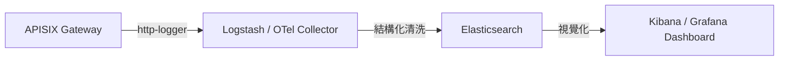

# Milk API Manager System: API 稽核日誌與 ELK 整合方案 (Issue #15)

## 1. 日誌採集與收容路徑
針對保險業 Q7 與 Q14 稽核要求，設計了全量日誌收容流水線。


```mermaid
graph LR
    Gateway[APISIX Gateway] -->|http-logger| Collector[Logstash / OTel Collector]
    Collector -->|結構化清洗| ES[Elasticsearch]
    ES -->|視覺化| Kibana[Kibana / Grafana Dashboard]
```

## 2. APISIX 日誌配置範本
採用 `http-logger` 插件將詳細的流量元數據推送到中央日誌庫。

```json
{
  "http-logger": {
    "uri": "http://logstash-svc:8080/apisix/logs",
    "batch_max_size": 100,
    "include_req_body": true,
    "include_resp_body": false,
    "custom_fields": {
      "cluster_id": "enterprise-k8s-01",
      "env": "production"
    }
  }
}
```

## 3. 稽核看板關鍵指標
*   **API 成功率 (2xx vs 4xx/5xx)**。
*   **回應時間 (Latency) 分布熱點**。
*   **來源 IP 地理分佈與頻次分析**。
*   **非法存取偵測紀錄**。

## 4. SLO 觀測指標（Control Plane）
系統已提供 Prometheus 格式端點 `GET /metrics/slo`，供控制平面 SLO 追蹤：

- `milk_control_plane_success_rate_percent`
  - 定義：最近視窗內（預設 15 分鐘）控制平面操作成功率（2xx/3xx）。
  - 來源：`AuditLogs`。
- `milk_sync_latency_p95_seconds`
  - 定義：最近視窗內 outbox 已處理事件的 P95 同步延遲（秒）。
  - 來源：`SyncOutboxEntries` 的 `ProcessedAt - CreatedAt`。
- `milk_blacklist_drift_count`
  - 定義：DB 與 APISIX 黑名單總漂移數。
  - 補充分解：
    - `milk_blacklist_drift_database_only_count`
    - `milk_blacklist_drift_gateway_only_count`

> 指標時間視窗可由 `Slo:WindowMinutes` 調整（`backend/MilkApiManager/appsettings.json`）。

## 5. PromQL 查詢範本（Grafana/Alert Rule 可共用）

### 5.1 Control-plane Success Rate
```promql
milk_control_plane_success_rate_percent
```

### 5.2 Sync Latency P95
```promql
milk_sync_latency_p95_seconds
```

### 5.3 Drift Count（總量）
```promql
milk_blacklist_drift_count
```

### 5.4 Drift Breakdown
```promql
milk_blacklist_drift_database_only_count
```

```promql
milk_blacklist_drift_gateway_only_count
```

## 6. 告警門檻建議（初始值）
以下為可直接上線的第一版門檻，建議依實際負載與誤報率每 2 週調整一次。

- **Critical**：`milk_control_plane_success_rate_percent < 99` 持續 10 分鐘。
- **Warning**：`milk_control_plane_success_rate_percent < 99.5` 持續 10 分鐘。
- **Critical**：`milk_sync_latency_p95_seconds > 30` 持續 10 分鐘。
- **Warning**：`milk_sync_latency_p95_seconds > 15` 持續 10 分鐘。
- **Critical**：`milk_blacklist_drift_count > 0` 持續 5 分鐘（安全配置不一致）。

### 6.1 Alert Rule（Prometheus 範例）
```yaml
groups:
  - name: milk-slo-alerts
    rules:
      - alert: MilkControlPlaneSuccessRateLow
        expr: milk_control_plane_success_rate_percent < 99
        for: 10m
        labels:
          severity: critical
        annotations:
          summary: "Control-plane success rate below SLO"
          description: "milk_control_plane_success_rate_percent < 99 for 10m"

      - alert: MilkSyncLatencyP95High
        expr: milk_sync_latency_p95_seconds > 30
        for: 10m
        labels:
          severity: critical
        annotations:
          summary: "Sync latency P95 exceeds threshold"
          description: "milk_sync_latency_p95_seconds > 30 for 10m"

      - alert: MilkBlacklistDriftDetected
        expr: milk_blacklist_drift_count > 0
        for: 5m
        labels:
          severity: critical
        annotations:
          summary: "Blacklist drift detected between DB and APISIX"
          description: "milk_blacklist_drift_count > 0 for 5m"
```
