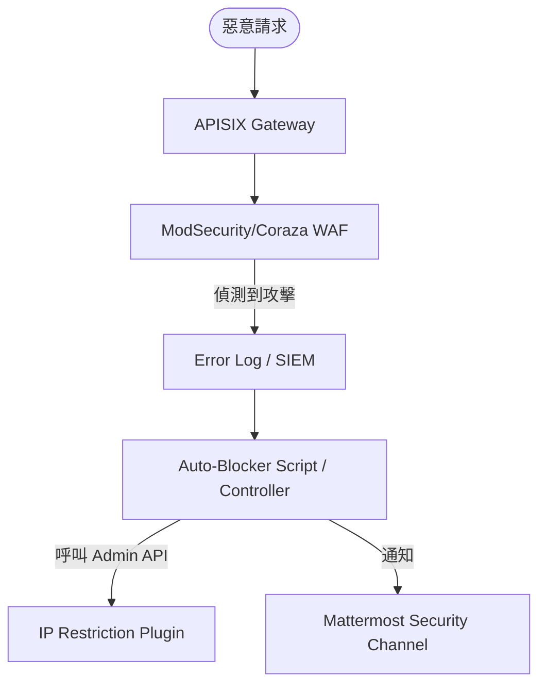

# Milk API Manager System: 異常流量自動阻斷設計 (Issue #17)

## 1. 運作流程
本方案實作 AIOps 自動化防禦路徑，將 WAF 的偵測結果轉化為網關層級的即時阻斷。



## 2. 核心組件實作
### 2.1 阻斷腳本 (`scripts/auto-blocker.sh`)
偵測 WAF 日誌中的高風險 IP 並呼叫 APISIX Admin API 加入黑名單。

```bash
#!/bin/bash
# 簡易 Mock 邏輯：偵測 403 頻繁出現的 IP
BLOCK_THRESHOLD=10
LOG_FILE="/var/log/apisix/error.log"

# 提取異常 IP
TARGET_IP=$(tail -n 100 $LOG_FILE | grep "WAF" | awk '{print $1}' | sort | uniq -c | awk -v limit=$BLOCK_THRESHOLD '$1 > limit {print $2}')

if [ ! -z "$TARGET_IP" ]; then
    echo "[SECURITY] 偵測到惡意 IP: $TARGET_IP，執行自動阻斷..."
    # 呼叫 APISIX Admin API 啟用 ip-restriction 插件
    # curl -X PUT http://127.0.0.1:9180/apisix/admin/routes/1 ...
fi
```

### 2.2 Mattermost 通報範本
當阻斷發生時，發送以下格式至營運頻道：
> 🚨 **資安自動阻斷通報**
> - **來源 IP**: `1.2.3.4`
> - **觸發原因**: SQL Injection 攻擊 (WAF Rule 942100)
> - **處理動作**: 已加入黑名單 (TTL: 24h)
